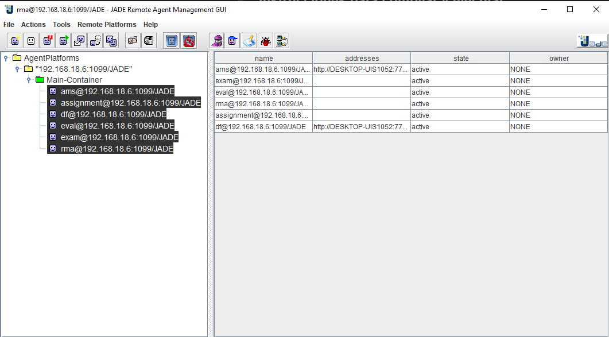

# Aplicación de Sistema Multi‑Agente de Evaluación de Notas

## Integrantes

* Berrio Huamani, Miguel Angel (25207049)
* Yauri Martinez, Luis David (25207075)

## Descripción del problema

El encargo consiste en desarrollar una aplicación usando la **plataforma JADE** que demuestre la colaboración entre agentes inteligentes.  Las especificaciones exigidas son:

* Utilizar **al menos tres agentes**.
* Registrar y descubrir servicios mediante las **páginas amarillas** (Directorio de Facilitadores de JADE, *DF*).
* Permitir el **envío de mensajes** entre agentes usando objetos `ACLMessage`.
* Cada agente debe implementar una **lógica de negocio independiente** y sus resultados deben ser consumidos por otro agente, evidenciando la cooperación.

## Diseño de la aplicación propuesta

Con base en los requisitos anteriores se diseñó un sistema multi‑agente para **evaluar la calificación final de un estudiante** combinando la nota del examen y la nota de tareas.  La aplicación usa cuatro agentes (es perfectamente válido usar más de tres):

| Agente | Servicio registrado (DF) | Lógica de negocio | Mensajes que procesa |
| --- | --- | --- | --- |
| `ExamAgent` | `grade.exam` | Mantiene un mapa de notas de examen por ID de estudiante y responde con la nota correspondiente o *NA* si no existe. | Recibe un `ACLMessage` cuyo contenido es el ID del estudiante y responde con la nota del examen. |
| `AssignmentAgent` | `grade.assignment` | Guarda las notas de tareas por ID y devuelve la nota solicitada. | Recibe un `ACLMessage` con el ID del estudiante y responde con la nota de tareas. |
| `EvaluatorAgent` | `grade.calculate` | Cuando recibe un ID de estudiante solicita a los agentes anteriores las notas de examen y tareas. Calcula la nota final (60 % examen + 40 % tareas) y la devuelve. | Recibe un `ACLMessage` con el ID del estudiante; envía mensajes a `ExamAgent` y `AssignmentAgent`, espera las respuestas y finalmente responde al agente solicitante con la nota final. |
| `StudentAgent` | — | No registra servicios; actúa como cliente que inicia la consulta. | Obtiene como argumento el ID del estudiante, busca un servicio `grade.calculate`, envía el ID al evaluador y muestra la nota final recibida. |

La figura siguiente muestra la arquitectura propuesta.  Todos los agentes se registran en el facilitador de servicios (páginas amarillas), lo que permite que los agentes consumidores localicen a los proveedores de servicio en tiempo de ejecución.  Los flechas indican el intercambio de mensajes.



### Registro en las páginas amarillas

Los agentes `ExamAgent`, `AssignmentAgent` y `EvaluatorAgent` llaman a `DFService.register(...)` durante su método `setup()` pasando una instancia de `ServiceDescription` que define el **tipo de servicio** (`grade.exam`, `grade.assignment` o `grade.calculate`) y opcionalmente un nombre.  Este registro se almacena en el directorio de facilitadores de JADE y permite que otros agentes encuentren servicios sin conocer de antemano la identidad de los proveedores.

### Búsqueda de servicios y envío de mensajes

Cuando `StudentAgent` arranca lee el argumento con el ID del estudiante.  A continuación construye un objeto `ServiceDescription` con `setType("grade.calculate")` y ejecuta `DFService.search(...)`.  Si la búsqueda devuelve uno o más agentes, envía un `ACLMessage` de tipo `REQUEST` con el ID al primer agente retornado.

`EvaluatorAgent` recibe este mensaje e inicia su propia búsqueda para localizar agentes que ofrezcan `grade.exam` y `grade.assignment`.  A continuación envía un mensaje de solicitud a cada uno de ellos con el ID del estudiante y espera las respuestas.  Una vez obtenidas ambas notas calcula la nota final usando una media ponderada (60 % examen y 40 % tareas) y responde al agente solicitante.

## Código fuente principal

Los cuatro agentes se implementan en Java usando las clases de JADE.  A continuación se muestran extractos relevantes; el código completo se encuentra en el repositorio del proyecto (`multiagent‑evaluacion`).

## Instrucciones para compilar y ejecutar

Para ejecutar la aplicación se requiere tener instalado **Java JDK8 o superior** y el archivo `jade.jar`.  En el repositorio se incluye `jade.jar` que puede descargarse desde el sitio oficial de JADE.  Los pasos para compilar y ejecutar son:

1. Clonar el repositorio del grupo y ubicarse en la carpeta `multiagent‑evaluacion`.
   ```bash
   # Linux/macOS
   cd .\multiagent-evaluacion\
   # Windows
   cd .\multiagent‑evaluacion\
   ```
2. Compilar los agentes (en Linux/macOS el separador de clase es `:` y en Windows es `;`):
   ```bash
   # Linux/macOS
   javac -cp .:../jade.jar *.java
   # Windows
   javac -cp .;..\jade.jar *.java
   ```
3. Ejecutar la plataforma JADE con GUI y cargar los agentes.  El parámetro `-gui` abre la interfaz gráfica; `-agents` define los agentes a iniciar (nombre:clase).  Un ejemplo para evaluar al estudiante **1001** es:
   ```bash
   # Linux/macOS
   java -cp .:../jade.jar jade.Boot -gui \
        -agents "exam:ExamAgent;assignment:AssignmentAgent;eval:EvaluatorAgent;student:StudentAgent(1001)"
   # Windows
   java -cp .;..\jade.jar jade.Boot -gui \
        -agents "exam:ExamAgent;assignment:AssignmentAgent;eval:EvaluatorAgent;student:StudentAgent(1001)"
   ```
4. En la consola del `StudentAgent` se imprimirá la calificación final recibida.  También puede iniciarse la aplicación sin GUI reemplazando `-gui` por `-container` o simplemente omitiendo la opción; sin embargo, la GUI es útil para las capturas de pantalla del informe y para observar el registro de agentes.

## Conclusión

La aplicación propuesta cumple con los requisitos del trabajo práctico: involucra **cuatro agentes** con lógicas de negocio independientes, utiliza las **páginas amarillas** para registrar y descubrir servicios, intercambia **mensajes ACL** para solicitar y responder información y demuestra la **colaboración** entre agentes, pues el `EvaluatorAgent` consume los resultados de `ExamAgent` y `AssignmentAgent` para calcular una nota final que luego es consumida por `StudentAgent`.  Siguiendo las instrucciones de compilación y ejecución presentadas se puede reproducir la aplicación, documentarla con capturas de pantalla y preparar un vídeo demostrativo para la entrega final.

## Casos de uso

### Caso de uso 1 – Evaluación del estudiante 1001

Comando ejecutado:
```bash
    java -cp ".;..\jade.jar" jade.Boot -gui -agents "exam:ExamAgent;assignment:AssignmentAgent;eval:EvaluatorAgent;student:StudentAgent(1001)"
```
Descripción:

Al iniciar la plataforma JADE con este comando se crean cuatro agentes: ExamAgent, AssignmentAgent, EvaluatorAgent y StudentAgent.

ExamAgent y AssignmentAgent registran sus servicios grade.exam y grade.assignment en las páginas amarillas y contienen las notas parciales de varios estudiantes.

StudentAgent, configurado con el ID de alumno 1001, solicita al EvaluatorAgent la calificación final para ese estudiante.

EvaluatorAgent consulta las páginas amarillas para localizar a ExamAgent y AssignmentAgent, solicita las notas parciales (examen = 18, tareas = 16) y calcula la nota final aplicando el 60 % al examen y el 40 % a las tareas:

final=0,6×18+0,4×16=17,2

El StudentAgent recibe el mensaje con la calificación final 17.2 y la imprime en consola. Este caso demuestra cómo los agentes colaboran para producir un resultado combinando servicios registrados en el DF.


### Caso de uso 2 – Evaluación del estudiante 1002

Comando ejecutado:
```bash
   java -cp ".;..\jade.jar" jade.Boot -gui -agents "exam:ExamAgent;assignment:AssignmentAgent;eval:EvaluatorAgent;student:StudentAgent(1002)"
```
Descripción:

Los agentes vuelven a registrarse y operar como en los casos anteriores.

StudentAgent se inicializa con el ID 1002 y envía la solicitud al EvaluatorAgent.

EvaluatorAgent consulta a ExamAgent y AssignmentAgent, obtiene las notas parciales (examen = 14,5; tareas = 15) y calcula la nota final:

final=0,6×14,5+0,4×15=14,7

El resultado 14.7 se devuelve al StudentAgent, que lo muestra al usuario. Esta ejecución confirma que el cálculo se adapta a cada estudiante.

### Caso de uso 3 – Evaluación del estudiante 1003

Comando ejecutado:
```bash
   java -cp ".;..\jade.jar" jade.Boot -gui -agents "exam:ExamAgent;assignment:AssignmentAgent;eval:EvaluatorAgent;student:StudentAgent(1003)"
```
Descripción:

Los agentes vuelven a registrarse y operar como en los casos anteriores.

El StudentAgent con ID 1003 solicita su calificación final al EvaluatorAgent.

EvaluatorAgent recupera las notas parciales (examen = 12; tareas = 13,5) y calcula:

final=0,6×12+0,4×13,5=12,6.

El StudentAgent recibe la calificación 12.6 y la muestra en consola.